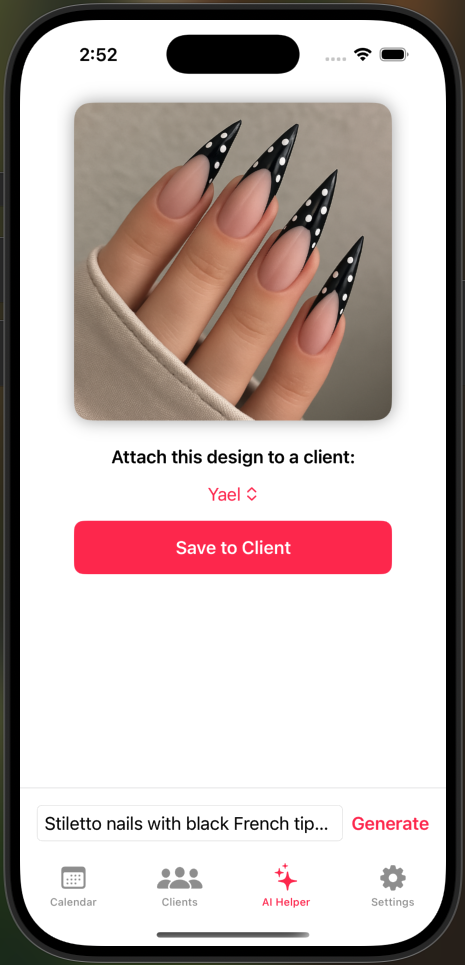
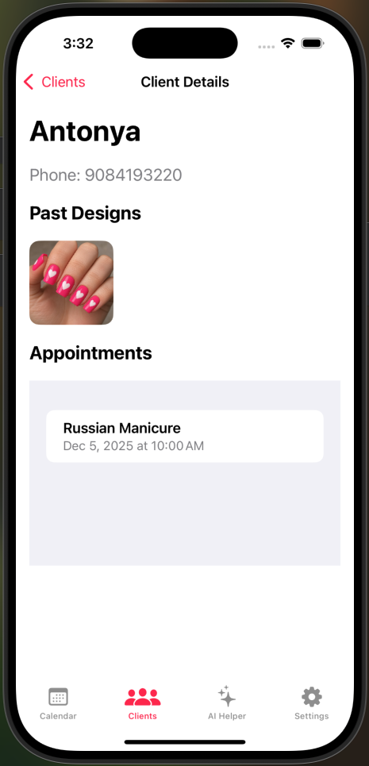
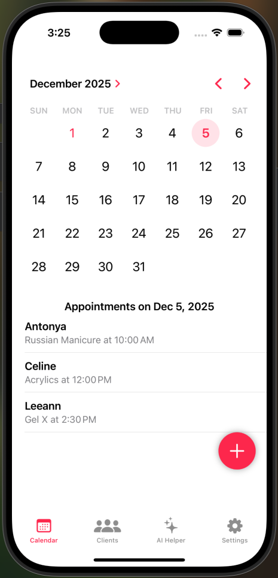

<link rel="stylesheet" href="/Nail-Design-Assistant/assets/css/theme.css">

# Nail Design Assistant 💅  
*An AI-powered mobile tool for professional nail technicians*

Nail Design Assistant is an iOS app built specifically for **nail technicians** to help them manage their clients, track appointments, and generate creative nail art ideas using AI. The project combines a SwiftUI front-end with a **Node.js backend** that wraps OpenAI’s image generation models, ensuring that all prompts are transformed into nail-only designs. This prevents misuse as a general image generator and keeps the experience tailored to beauty professionals.

## 🎯 Project Overview
This app was developed as my CSU Channel Islands Capstone Project. My goal was to build a clean, efficient tool that nail techs can rely on for organization and creativity. The app allows techs to:

- Store and manage client profiles  
- Save and view past nail designs  
- Book and browse appointments on a built-in calendar  
- Generate AI-powered nail ideas customized from text prompts  
- Keep all client history connected within a single workflow  

## 🧱 Tech Stack
- **Frontend:** SwiftUI (iOS)  
- **Backend:** Node.js + Express (hosted on Render)  
- **AI:** OpenAI image generation (wrapped with nail-design–specific prompt engineering)  
- **Authentication:** Firebase Auth  
- **Database:** Firebase Firestore  
- **Hosting:** GitHub Pages (this site)  

## ✨ Key Features
- **AI Nail Design Generator** – Takes short text prompts and converts them into nail-specific visual designs using a controlled prompt wrapper.  
- **Client Management** – Create, edit, and delete client profiles, including phone numbers and saved nail designs.  
- **Appointment System** – Book, edit, and delete appointments via a graphical calendar.  
- **Design History** – Store generated designs under specific clients for reference and inspiration.  
- **Secure Login** – Powered by Firebase for a simple email/password login flow.  

## 👩🏻‍💻 What I Learned
I developed this entire project **solo**, and I’m genuinely glad I did. Working independently forced me to learn *every* major part of building a complete application:

- Designing a scalable Firestore data model  
- Building complex UI flows in SwiftUI  
- Handling real-time listeners and state synchronization  
- Creating and deploying a **Node.js backend**  
- Engineering AI prompts so the generator is limited to nail-only outputs  
- Managing app navigation, user experience, and polish  
- Debugging across devices and computers  
- Thinking like a full-stack developer  

Completing every layer—backend, frontend, database, authentication, and AI—gave me a deep understanding of the entire development lifecycle and strengthened my confidence as an engineer.

## 📸 Screenshots
### AI Helper View

### Clients List

### Calendar View

## 🔗 Links
- **GitHub Repository:** https://github.com/zoehazan/Nail-Design-Assistant  
- **Capstone Poster (PDF):** [Download Poster](assets/docs/CapstonePoster.pdf)  

## 👩🏻‍💻 About the Developer
This project was created by **Zoe Hazan**, a Computer Science student at CSU Channel Islands.  
For questions or collaboration, you can reach me at: **zoehazan@gmail.com**

